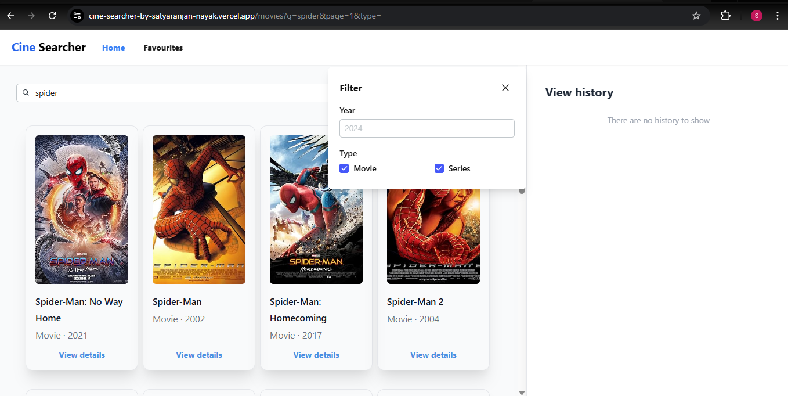
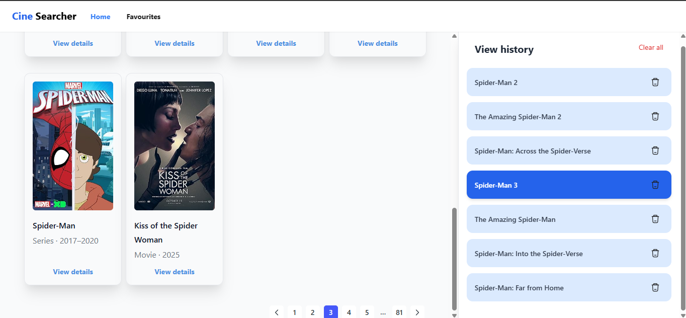
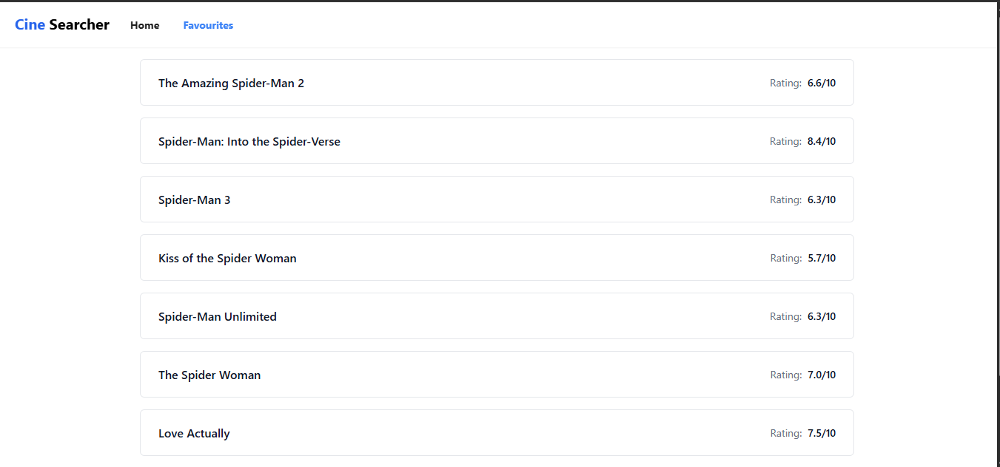

# 🎬 CineSearcher

[](https://reactjs.org/)
[](https://tailwindcss.com/)
[](https://github.com/pmndrs/zustand)
[](https://tanstack.com/query/latest)

**Live Deployment:** https://cine-searcher-by-satyaranjan-nayak.vercel.app/

CineSearcher is a high-performance movie and series discovery application powered by the OMDb API. It goes beyond a simple search tool by implementing strict, enterprise-level frontend architecture, robust state management, and optimized API handling.

## ✨ Key Features

* **Real-time Search & Debouncing:** Optimized search inputs that prevent API spamming while delivering instant results.
* **Advanced Filtering:** Filter by release year and media type with auto-submitting, validated forms.
* **Persistent User Data:** Search history and favorites are managed via a centralized store and persisted across sessions.
* **Internationalization (i18n):** Multi-language support seamlessly integrated using custom Higher-Order Components (HOCs).
* **Responsive UI:** Clean, modern interface built with Tailwind CSS and NeetoUI components.

---

## 🏗️ Architecture & Engineering Standards

This project was built adhering to strict, production-grade conventions (inspired by BigBinary's architectural standards) to ensure scalability, readability, and maintainability.

### 1. Robust API Layer & Interceptors
* **No Direct API Calls in Components:** All API requests are abstracted into an `apis/` layer and consumed via **React Query** custom hooks.
* **Data Transformation Interceptors:** The OMDb API returns inconsistent `PascalCase` keys (e.g., `TotalResults`). A custom recursive Axios interceptor automatically transforms all incoming data payloads into standard `camelCase` before it reaches the UI.
* **Global Error Handling:** API responses with `"Response": "False"` are intercepted and thrown as standard JS errors, cleanly caught by React Query.

### 2. Form Management & Validation
* **Formik & Yup:** Complex states for filtering are not handled by messy `useState` hooks. Forms are wrapped in Formik context with strict declarative validation schemas via Yup (e.g., preventing future year inputs).
* **Auto-Submit & Debouncing:** Implemented a contextual auto-submit mechanism that listens to Formik's `dirty` state and debounces the submission to drastically reduce unnecessary API calls while providing a fluid UX.

### 3. State Management
* **Client State (Zustand):** Used for global UI state (like managing the active movie, search history, and favorites). Integrated with `persist` middleware for seamless `localStorage` syncing.
* **Server State (React Query):** Used strictly for caching, fetching, and updating asynchronous data from the OMDb API.
* **URL State:** Shareable states like search queries and active page numbers are kept in the URL parameters using a custom `useQueryParams` hook.

### 4. Component Design Patterns
* **Higher-Order Components (HOCs):** Created custom wrappers like `withT` to cleanly inject translation dependencies without cluttering component logic.
* **Separation of Concerns:** Business logic (fetching, form handling) is decoupled from presentational UI components.

---

## 🛠️ Tech Stack

* **Core:** React.js, React Router DOM
* **State Management:** Zustand, @tanstack/react-query
* **Forms & Validation:** Formik, Yup
* **Network:** Axios (with custom interceptors)
* **Styling & UI:** Tailwind CSS, NeetoUI, NeetoIcons
* **Utilities:** Day.js, i18next, Ramda

---

## 🚀 Local Development Setup

### Prerequisites
* Node.js (v16 or higher)
* Yarn
* OMDb API Key (Get one at [omdbapi.com](http://www.omdbapi.com/))

### Installation Steps

1.  **Clone the repository:**
    ```bash
    git clone https://github.com/Satya-0611/CineSearcher-by-satyaranjan-nayak
    cd cine-searcher
    ```

2.  **Install dependencies:**
    ```bash
    yarn install
    ```

3.  **Environment Variables:**
    Create a `.env` file in the root directory and add your API key:
    ```env
    REACT_APP_OMDB_API_KEY=your_api_key_here
    REACT_APP_BASE_URL=https://www.omdbapi.com/
    ```

4.  **Start the development server:**
    ```bash
    yarn start
    ```
    The application will be available at `http://localhost:3000`.
   ** Preview **
    
    
    

---
*Designed and built with a focus on scalable frontend architecture.*
